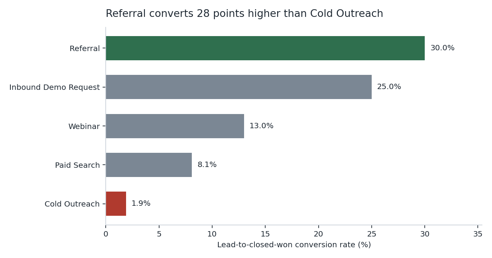
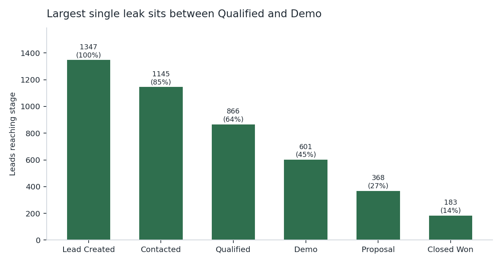

# Sales Funnel & Lead Conversion Diagnostic

**Where does a B2B SaaS funnel actually leak, and which acquisition channels are quietly burning budget?**

A reproducible SQL diagnostic over 1,347 leads and 4,500+ funnel events across 5 acquisition
channels. Built with window functions and conditional aggregation in SQLite, with a thin Python
layer to run the queries and publish the results.


---

## Headline findings

| | |
|---|---|
| **28.1-point conversion gap** | Referral converts at **30.0%** lead-to-closed-won; Cold Outreach at **1.9%** |
| **Cost per won deal varies 78x** | $60 per won deal on Referral vs **$4,650** on Cold Outreach |
| **Biggest funnel leak** | Qualified → Demo loses 265 leads (30.6% of survivors) |
| **Cold Outreach fails early** | Only 34% of its leads ever reach Qualified, vs 90% for Referral |
| **Not a segment mix effect** | Conversion is flat across SMB / Mid-Market / Enterprise, so the gap is channel-driven |





Full query-by-query output: **[results/findings.md](results/findings.md)**

---

## The business question

Marketing reports a healthy top-of-funnel. Sales reports a weak pipeline. Both are right, which
means the problem is somewhere in the middle. The diagnostic answers three questions:

1. **Which stage** of the funnel loses the most leads?
2. **Which channel** is responsible, once volume is controlled for?
3. **Is the gap real**, or just a mix effect from different company sizes landing in different channels?

## The data

Synthetic, generated by [`scripts/generate_data.py`](scripts/generate_data.py) with a fixed random
seed, so anyone cloning this repo reproduces the exact numbers above.

| Table | Rows | Grain |
|---|---|---|
| `leads` | 1,347 | One row per lead: channel, created date, region, company size, acquisition cost |
| `lead_events` | 4,510 | One row per funnel stage a lead actually reached |

The funnel is modelled as an **event log** rather than a status column. That is the whole point:
a status column only tells you where a lead ended up, while an event log lets you measure
conversion at every single step.

```
lead_created → contacted → qualified → demo → proposal → closed_won
```

## Method

All analysis lives in [`sql/02_funnel_analysis.sql`](sql/02_funnel_analysis.sql) as five
independent queries.

**Conditional aggregation** collapses the event log to one row per lead per channel:

```sql
SUM(CASE WHEN furthest_stage >= 3 THEN 1 ELSE 0 END) AS qualified,
SUM(CASE WHEN furthest_stage >= 6 THEN 1 ELSE 0 END) AS closed_won
```

**`LAG()` over the stage order** turns survivor counts into step conversion without a self-join:

```sql
ROUND(100.0 * leads_reached
      / LAG(leads_reached) OVER (PARTITION BY channel ORDER BY stage_order), 1)
    AS step_conv_pct
```

**`RANK()` and an unbounded `MAX() OVER ()`** express every channel as a gap against the best
performer, which is the number that actually drives a budget conversation.

| Query | What it answers |
|---|---|
| Q1 | Channel scoreboard: conversion, rank, gap to best, cost per won deal |
| Q2 | Overall stage-by-stage drop-off and leakage |
| Q3 | Per-channel leak profile — *where* each channel dies |
| Q4 | Funnel velocity: average and median days to close by channel |
| Q5 | Segment control: does company size explain the gap? (it doesn't) |

## What I'd recommend on the back of it

1. **Cap Cold Outreach spend.** It absorbs 27% of lead spend and returns 3% of won deals. At
   $4,650 per win it is almost certainly below payback on any realistic ACV.
2. **Fix the Qualified → Demo handoff first.** It is the single largest leak in absolute terms and
   affects every channel, so it has the broadest payoff.
3. **Fund the referral motion.** It is the cheapest and highest-converting channel but the smallest
   by volume — the constraint is supply, not quality.
4. **Re-examine the qualification bar on Paid Search.** It survives first contact but only 62% of
   its leads qualify, which points at intent mismatch rather than rep execution.

## Run it yourself

```bash
git clone https://github.com/YOUR-USERNAME/sales-funnel-diagnostic.git
cd sales-funnel-diagnostic
pip install -r requirements.txt

python scripts/generate_data.py   # builds data/funnel.db
python scripts/run_analysis.py    # writes results/findings.md
python scripts/make_charts.py     # writes the PNGs used above
```

Or explore the database directly:

```bash
sqlite3 data/funnel.db < sql/02_funnel_analysis.sql
```

## Repo structure

```
sales-funnel-diagnostic/
├── sql/
│   ├── 01_schema.sql            # table definitions
│   └── 02_funnel_analysis.sql   # the 5 analysis queries
├── scripts/
│   ├── generate_data.py         # seeded synthetic data builder
│   ├── run_analysis.py          # runs every query, writes findings.md
│   └── make_charts.py           # README charts
├── results/
│   ├── findings.md              # committed query output
│   ├── channel_conversion.png
│   └── funnel_dropoff.png
└── .github/workflows/run.yml    # CI: regenerates results on every push
```

## Caveats

- The dataset is **synthetic**. It is built to be realistic and internally consistent, not to
  represent any real company's data.
- Cost per won deal uses blended acquisition cost only; it excludes sales salary and tooling, so it
  is a channel-comparison metric rather than a true CAC.
- The funnel is modelled as strictly linear. Real funnels have re-entry and stage skipping.

## License

MIT
